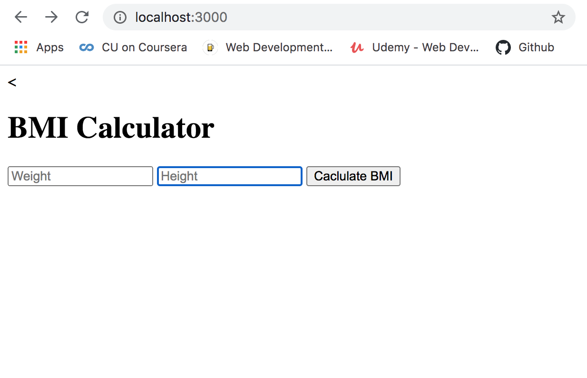
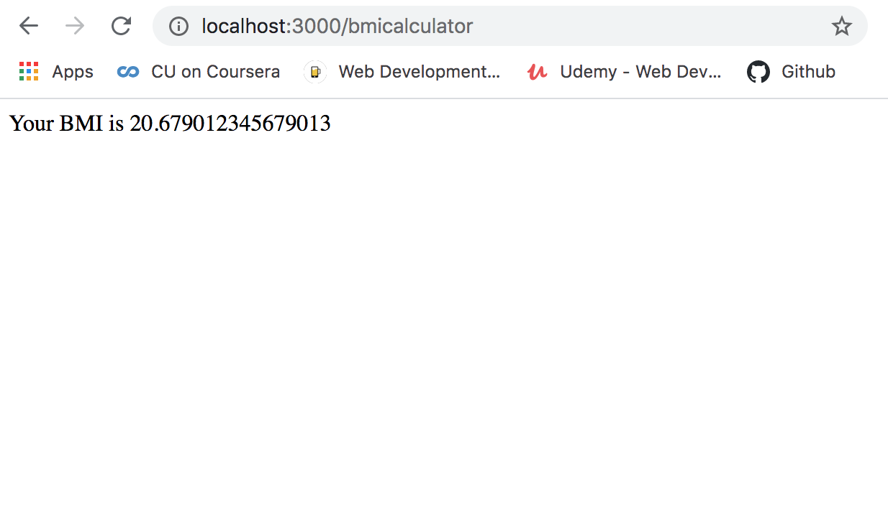

# ExpressJS
* Learn how to setup Express.js
* Use nodemon for refreshing node server automatically
* Learn about body-parser,  
* Handle basic GET and POST requests
* Create simple calculator app

  

 

  

